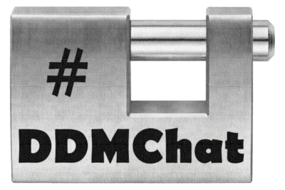

# DDMChat - DataDistributionManager Kafka and OpenDDS chat
__Ver 0.6.0.0__
**DDMChat** is a chat software based on the [DataDistributionManager](https://github.com/masesgroup/DataDistributionManager) project that can use **Kafka** and **OpenDDS** as communication channel.
Similar to a Bullettin Board System every chat client writes messages in plain text to the communication channel and every other client can read it, but messages can also be addressed to single users. Messages addressed to specific users are **encrypted** using **symmetric** and **asymmetric** encryption, and they are encapsulated on a plain message envelop.  

## Communication Architecture
**DDMChat** uses two channels, the first one for message communication, the second one to communicate user profiles. 
Every client, at connection time, broadcasts its profile, communicating the username and the public encryption key.
All messages are encoded in json.

## C# Projects
In the src/ folder there are all Visual Studio projects and the complete solution. Projects are designed to be a base for other projects. ChatUi is the GUI frontend based on ChatLib and CommunicationLib, but CLI, or other user interfaces, can be easly implemented on top of these two libraries. 

### CommunicationLib
It Contains classes dedicated to the [DataDistributionManager](https://github.com/masesgroup/DataDistributionManager) management and exposes the ICommunication interface to simplify the communication processes.

### ChatLib
It Contains classes for messages and encryption management.
The following messages types are implemented:
- STRING
- USER
- IMAGE
- URL
- FILE
- ENCRYPTED

### ChatUI
It is the Chat User interface and implements the following features:
- let the user to choose between Kafka and OpenDDS communication channels
- for OpenDDS an option is available to start a local Inforepo
- displays the list of users connected to the chat
- allows to send and receive encrypted messages
- display communication status and errors 
- features a volatile chat board and user list.
- Is supports the following messages:
  - STRING
  - USER
  - ENCRYPTED

  
## Future developments
This is the first public version of this project, more work shall be done to extend the configuration features and, on the user interface, to better manage message visualization on the message visualization area. 
Users online status should be taken in account.
Improvements are needed on the channels management to take advanteges of the kafka and OpenDDS topic history.
Last but not least still be managed the sending of audios, videos, images, files and urls.

Take a look at the issue section for requested features: **contributors are welcome**.

